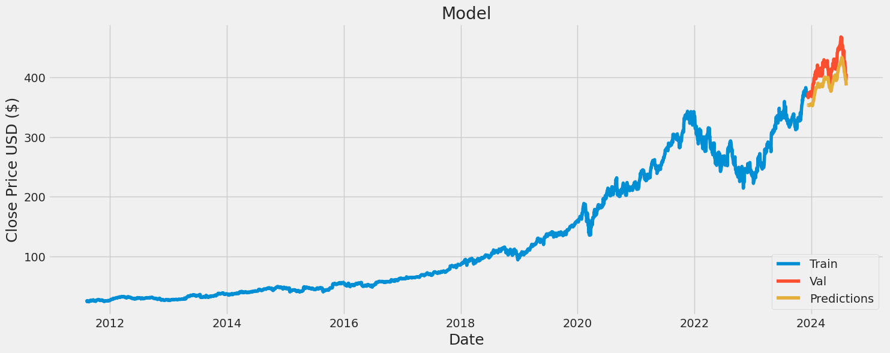

# Stock Price Prediction and Analysis

## Introduction
This project involves analyzing the historical stock prices of major technology companies and predicting the closing stock price of Microsoft using an LSTM model. The analysis includes descriptive statistics, visualization of stock trends, and a machine learning model to predict future stock prices.

## Data Collection
Stock price data for Apple, Google, Microsoft, and Amazon were collected using the Yahoo Finance API (`yfinance`). The dataset includes historical data such as the adjusted closing price, volume, and daily returns.

## Data Analysis
### Descriptive Statistics and Visualization
1. **Closing Prices**: Historical closing prices of the stocks were plotted to visualize trends.
2. **Volume**: The total volume of stocks traded each day was analyzed.
3. **Moving Averages**: Calculated for 10, 20, and 50 days to observe the smoothing of stock price data.
4. **Daily Returns**: The daily return percentages were computed and plotted to understand the volatility.
5. **Correlation**: Heatmaps and scatter plots were used to compare daily returns between different stocks.

### Visual Analysis Techniques
- Histograms
- Line plots
- Joint plots
- Pair plots
- Heatmaps

## Model Building
### Data Preparation
- **Data Scaling**: The stock price data was scaled using `MinMaxScaler` to normalize the values.
- **Training and Testing Split**: The data was split into training (95%) and testing (5%) sets.
- **Feature Creation**: Created sequences of 60-day closing prices as features for the model.

### Model Architecture
- **LSTM Layers**: The model consists of two LSTM layers with 128 and 64 units, followed by dense layers.
- **Activation Functions**: Used 'tanh' for LSTM layers and 'relu' for dense layers.
- **Early Stopping**: Implemented to prevent overfitting and to restore the best weights.

### Model Training
- **Optimizer**: Adam optimizer was used.
- **Loss Function**: Mean squared error (MSE) was chosen as the loss function.
- **Training**: The model was trained for 100 epochs with a batch size of 16, using early stopping to halt training when the validation loss did not improve.

### Model Evaluation
- **Predictions**: The model's predictions on the test data were transformed back to the original scale.
- **RMSE**: The root mean squared error (RMSE) of the model was calculated to be 7.

## Results
The model's performance is visualized by plotting the true and predicted closing prices. The RMSE of 7 indicates that the model's predictions are fairly close to the actual values, showcasing its effectiveness in predicting stock prices.

## Conclusion
This project successfully demonstrates the application of LSTM neural networks in predicting stock prices. The detailed analysis and visualization provide insights into stock trends, and the model's performance highlights the potential of machine learning in financial forecasting.

## Dependencies
- pandas
- numpy
- matplotlib
- seaborn
- yfinance
- pandas_datareader
- scikit-learn
- tensorflow
- keras
